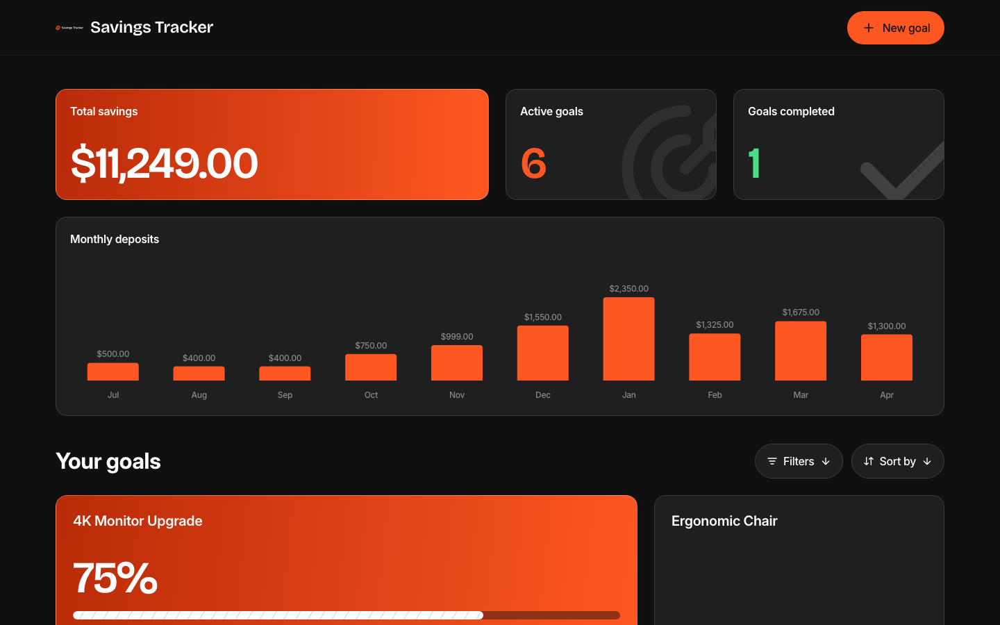
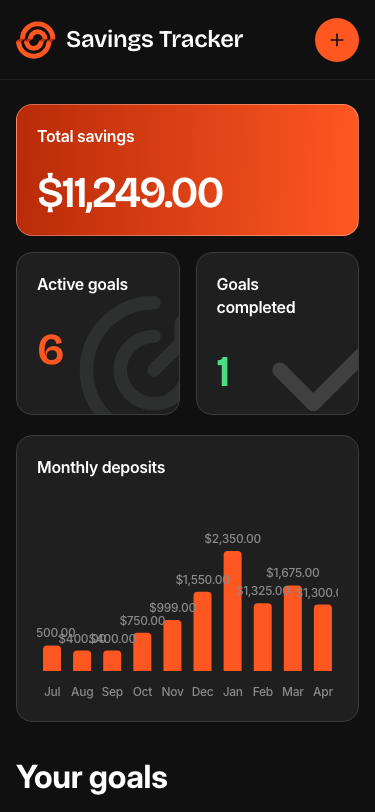

# Frontend Mentor — Savings Tracker

A fully-featured savings goals tracker built as a solution to the [Savings Tracker challenge on Frontend Mentor](https://www.frontendmentor.io/challenges/savings-tracker). Track multiple savings goals, log deposits, visualise monthly progress with a bar chart, and filter/sort goals — all persisted locally in the browser.


---

## Table of Contents

- [Overview](#overview)
  - [The Challenge](#the-challenge)
  - [Screenshots](#screenshots)
  - [Links](#links)
- [My Process](#my-process)
  - [Built With](#built-with)
  - [Project Structure](#project-structure)
  - [What I Learned](#what-i-learned)
  - [Continued Development](#continued-development)
  - [Useful Resources](#useful-resources)
  - [AI Collaboration](#ai-collaboration)
- [Getting Started](#getting-started)
- [Author](#author)
- [Acknowledgments](#acknowledgments)

---

## Overview

### The Challenge

Users are able to:

**Goal Management**
- Create a savings goal with name, target amount, and optional deadline
- Edit an existing goal's name, target, or deadline
- Delete a goal with a confirmation modal before permanent removal
- See inline form validation when required fields are missing or invalid

**Deposits**
- Add a deposit with an amount and optional note
- See an error when trying to add a deposit of $0 or less
- View full deposit history per goal (note, date, amount) sorted newest-first

**Dashboard**
- View a summary: total savings, number of active goals, goals completed
- See a monthly deposits bar chart showing saving activity across the last 12 months
- Browse all goals in a responsive card grid with name, progress %, amount saved, target, and deadline
- See an empty state with a call-to-action when no goals exist

**Filtering & Sorting**
- Filter goals by: All, In Progress, Completed, Not Started
- Sort goals by: Recently Added, Deadline, Progress, Amount Saved, Alphabetical

**Goal Detail**
- Progress view: percentage, progress bar, Saved / Target / Remaining amounts, deadline
- Completed view: total deposits count + total amount saved

**UI & Accessibility**
- Fully responsive layouts at 375px, 768px, and 1440px viewports
- Full keyboard navigation with visible focus rings
- Modal focus trap (Tab/Shift+Tab cycling, Escape key, overlay click to close)
- `aria-live="polite"` region announces CRUD actions to screen readers
- Semantic HTML5 (`header`, `main`, `section`, `article`, `nav`)

---

### Screenshots

<div align="center">

**Desktop — 1440px**



**Mobile — 375px**



</div>

---

### Links

- **Solution URL:** [github.com/gusanchefullstack/fsdev-savings-tracker](https://github.com/gusanchefullstack/fsdev-savings-tracker)
- **Live Site:** *(Deployed on Vercel — link added after deployment)*

---

## My Process

### Built With

- **React 19** — component model, hooks, controlled forms
- **TypeScript 5** with `verbatimModuleSyntax` — strict type safety
- **Vite 6** — dev server and production bundler
- **CSS Modules** — scoped styles, no CSS-in-JS overhead
- **CSS Custom Properties** — design token system for colours, typography, spacing, and radius
- **Recharts** — `ResponsiveContainer` + `BarChart` for the monthly deposits chart
- **localStorage** — goal and deposit persistence via a generic `useLocalStorage` hook
- Semantic HTML5, ARIA attributes, keyboard navigation best practices

---

### Project Structure

```
src/
├── components/
│   ├── Dashboard/       # StatsPanel, MonthlyDepositsChart
│   ├── Goals/           # GoalCard, GoalGrid, GoalDetail, GoalsControls, EmptyState
│   ├── Header/          # Sticky header with logo and "New goal" button
│   ├── Modals/          # ModalBase (focus trap), GoalForm, AddDepositModal, DeleteConfirmModal
│   └── UI/              # ProgressBar (3 variants)
├── data/
│   └── initialData.ts   # Seed data with date-offset algorithm
├── hooks/
│   ├── useGoals.ts      # All state logic: stats, CRUD, filter/sort, monthly deposits
│   └── useLocalStorage.ts
├── styles/
│   ├── reset.css        # Minimal CSS reset
│   ├── variables.css    # Design tokens as CSS custom properties
│   └── global.css       # Font-face declarations, base styles, .sr-only
├── types/
│   └── index.ts         # Goal, Deposit, FilterStatus, SortOption, ModalState
└── utils/
    ├── dateUtils.ts     # Date offset, formatting, overdue detection
    └── formatUtils.ts   # Currency, progress %, goal status
```

---

### What I Learned

**1. `display: contents` for responsive grid layouts**

On desktop the Stats Panel renders as a 3-column grid (`1fr 304px 304px`). On mobile, the two stat cards need to be side-by-side below the total savings card. Wrapping the stat cards in a `<div className={styles.statCards}>` and using `display: contents` on that wrapper for desktop/tablet lets its children participate directly in the parent CSS Grid — no extra markup needed. On mobile the wrapper switches to `display: grid; grid-template-columns: 1fr 1fr`.

```css
/* wrapper is invisible to parent grid on desktop */
.statCards { display: contents; }

@media (max-width: 767px) {
  .statCards {
    display: grid;
    grid-template-columns: 1fr 1fr;
    gap: var(--space-4);
  }
}
```

**2. Date-offset algorithm for always-current seed data**

The `data.json` file uses March 2026 as its reference month. A `MONTH_OFFSET` constant shifts every `createdAt` and `deadline` date forward so the data always feels current regardless of when the app is opened.

```ts
const now = new Date();
export const MONTH_OFFSET =
  (now.getFullYear() - 2026) * 12 + (now.getMonth() - 2); // March = month 2
```

**3. Modal focus trap without a library**

The `ModalBase` component implements a focus trap using native DOM APIs — no external dependency required. It collects all focusable elements inside the modal panel, listens for `Tab` / `Shift+Tab`, and cycles focus within them. On unmount, focus returns to the element that was active before the modal opened.

**4. TypeScript `verbatimModuleSyntax`**

The Vite template enables `verbatimModuleSyntax: true`, which requires every type-only import to use `import type { ... }` rather than `import { ... }`. This prevents type information from being included in the emitted JavaScript and caught the mistake across 12 files during the build.

**5. Asymmetric goal card grid**

The `GoalGrid` picks the first in-progress goal as the "featured" card. The featured row uses `grid-template-columns: 1fr 418px`; subsequent rows alternate `418px 1fr` and `1fr 418px` to create a dynamic, non-uniform layout at desktop widths.

---

### Continued Development

- Add server-side persistence (Supabase or PlanetScale) to enable multi-device sync
- Implement the optional auth flow (sign-up, login, password reset)
- Add animated progress bars and entrance transitions for goal cards
- Explore PWA support for offline usage and home-screen installation

---

### Useful Resources

- [Recharts documentation](https://recharts.org/en-US/) — `ResponsiveContainer`, `BarChart`, custom tooltips and labels
- [MDN: CSS Grid — `display: contents`](https://developer.mozilla.org/en-US/docs/Web/CSS/display#display_contents) — The key technique for the responsive stats panel
- [MDN: ARIA live regions](https://developer.mozilla.org/en-US/docs/Web/Accessibility/ARIA/ARIA_Live_Regions) — How `aria-live="polite"` announces UI changes to screen readers
- [Vite: `verbatimModuleSyntax`](https://vitejs.dev/guide/features.html#typescript) — Why type-only imports must use `import type`
- [Bricolage Grotesque on Google Fonts](https://fonts.google.com/specimen/Bricolage+Grotesque) — Display font used for large numbers and headings

---

### AI Collaboration

This project was built in close collaboration with **Claude (Anthropic)** using **Claude Code** — the AI-powered CLI.

**How it was used:**
- Generated the full project scaffold: Vite config, TypeScript setup, CSS reset and design token system
- Implemented all React components from Figma design specs extracted via the Figma MCP plugin
- Debugged TypeScript `verbatimModuleSyntax` errors across 12 files
- Implemented the date-offset algorithm to keep seed data current
- Produced the asymmetric CSS Grid layout for the goal card grid
- Set up git workflow, GitHub repo creation, and Vercel deployment

**What worked well:** Claude was accurate at extracting design intent from Figma and translating it into CSS custom properties and component structure. The iterative screenshot-and-fix loop for responsive design was fast.

**What needed human judgment:** Choosing the right breakpoints for the asymmetric card layout and deciding which goals to feature as the "primary" card required design intuition rather than mechanical extraction.

---

## Getting Started

### Prerequisites

- Node.js >= 18
- npm >= 9

### Installation

```bash
# 1. Clone the repository
git clone https://github.com/gusanchefullstack/fsdev-savings-tracker.git
cd fsdev-savings-tracker

# 2. Install dependencies
npm install

# 3. Start the dev server
npm run dev
```

The app runs at `http://localhost:5173`. Goals and deposits are persisted in `localStorage` — no backend required.

```bash
# Production build
npm run build

# Preview the production build locally
npm run preview
```

---

## Author

**Gustavo Sanchez Galarza**

[](https://www.linkedin.com/in/gustavosanchezgalarza/)
[](https://github.com/gusanchefullstack)
[](https://www.frontendmentor.io/profile/gusanchefullstack)
[](https://x.com/gusanchedev)
[](https://bsky.app/profile/gusanchedev.bsky.social)
[](https://hashnode.com/@gusanchedev)
[](https://www.freecodecamp.org/gusanchedev)

---

## Acknowledgments

- [Frontend Mentor](https://www.frontendmentor.io) for the challenge design and specifications
- [Recharts](https://recharts.org/) for the composable charting library
- [Bricolage Grotesque](https://fonts.google.com/specimen/Bricolage+Grotesque) and [Inter](https://fonts.google.com/specimen/Inter) for the typography
- [Anthropic Claude](https://www.anthropic.com) — AI collaborator throughout the build
